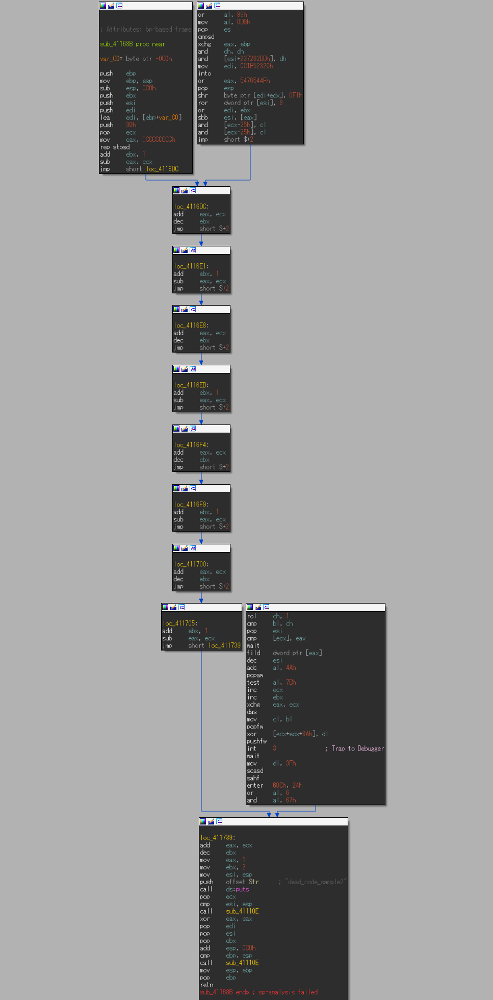
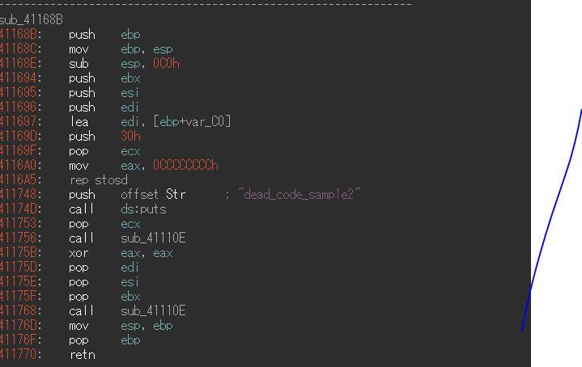

# nao
```nao(no-meaning assembly omiter)``` is dead code eliminator plugin for IDA pro.

before


after



## Requirement
- IDAPython
- [Unicorn](http://www.unicorn-engine.org/) and Python binding

### How to Install Unicorn
Please follow the link.

[Download – Unicorn – The ultimate CPU emulator](http://www.unicorn-engine.org/download/)

## Installation
Running ```nao.py``` as the IDAPython script.

## Usage
```Shift-D``` display eliminated disassemble code from current function.

## Licence
[GPL v3 license](LICENCE)
