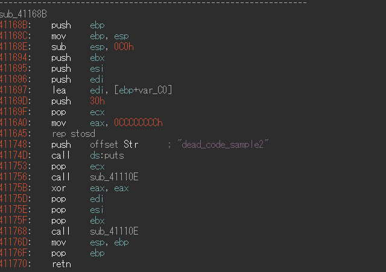
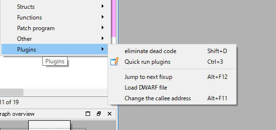

# nao
```nao(no-meaning assembly omiter)``` is simple dead code eliminator plugin for IDA pro.

**Nao is just a prototype**

before:


after:




## Requirement
- IDAPython
- [Unicorn](http://www.unicorn-engine.org/) and Python binding

### How to Install Unicorn
Please follow the link.

[Download – Unicorn – The ultimate CPU emulator](http://www.unicorn-engine.org/download/)

## Installation
Please copy the contents of ```nao``` directory in this repository to ```$IDA_ROOT/plugins``` folder, or just run ```nao/nao.py``` as the IDAPython script.
After you install nao.py, you'll see ```eliminate dead code``` button on Edit/Plugins menu.



## Usage
```Shift-D``` display eliminated disassemble code from current function.

## Licence
[GPL v3 license](LICENCE)
